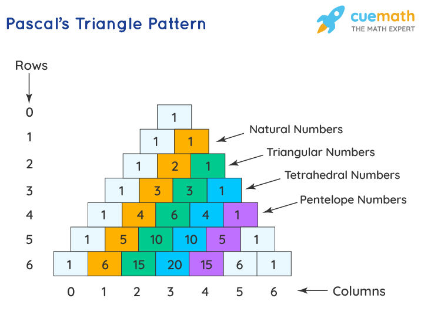

<h1>0x00. Pascal's Triangle</h1>

  
<h1>Tasks</h1>
<h3>0. Pascal's Triangle</h3>

Create a function def pascal_triangle(n): that returns a list of lists of integers representing the Pascal’s triangle of n:

<li>Returns an empty list if n <= 0</li>
<li>You can assume n will be always an integer</li> 
<pre>
guillaume@ubuntu:~/0x00$ cat 0-main.py
#!/usr/bin/python3
"""
0-main
"""
pascal_triangle = __import__('0-pascal_triangle').pascal_triangle

def print_triangle(triangle):
    """
    Print the triangle
    """
    for row in triangle:
        print("[{}]".format(",".join([str(x) for x in row])))

if __name__ == "__main__":
    print_triangle(pascal_triangle(5))

guillaume@ubuntu:~/0x00$ 
guillaume@ubuntu:~/0x00$ ./0-main.py
[1]
[1,1]
[1,2,1]
[1,3,3,1]
[1,4,6,4,1]
guillaume@ubuntu:~/0x00$ 

</pre>
<b>Repo:</b>

<li>GitHub repository: alx-interview</li>
<li>Directory: 0x00-pascal_triangle</li>
<li>File: 0-pascal_triangle.py</li>